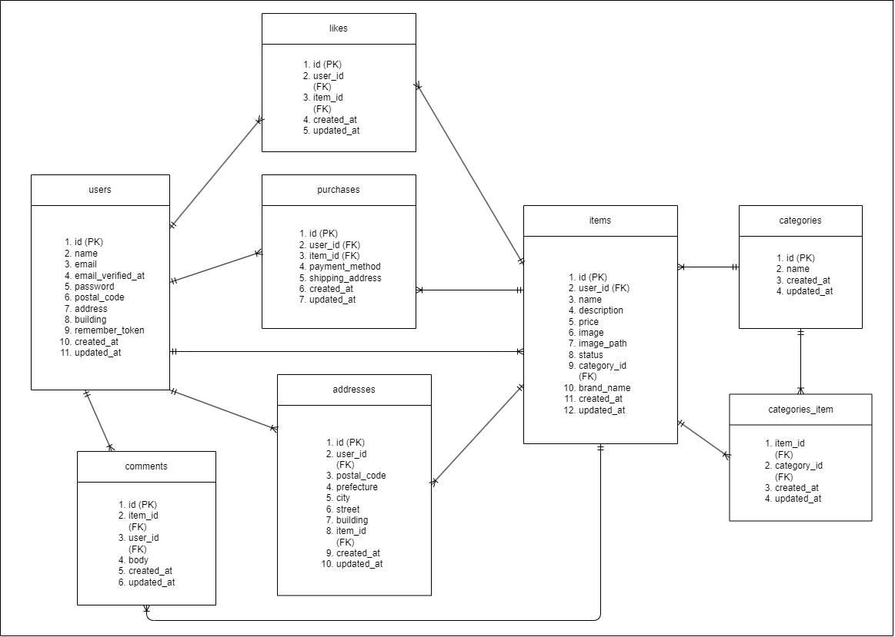

# フリマアプリ

## 環境構築

## メール認証

mailtrapというツールを使用しています。
以下のリンクから会員登録をしてください。　
https://mailtrap.io/

メールボックスのIntegrationsから 「SMTP」を選択し、
.envファイルのMAIL_MAILERからMAIL_ENCRYPTIONまでの項目をコピー＆ペーストしてください。
MAIL_FROM_ADDRESSは任意のメールアドレスを入力してください。

## Stripeについて

コンビニ支払いとカード支払いのオプションがありますが、決済画面にてコンビニ支払いを選択しますと、レシートを印刷する画面に遷移します。
そのため、カード支払いを成功させた場合に意図する画面遷移が行える想定です。

また、StripeのAPIキーは以下のように設定をお願いいたします。

STRIPE_PUBLIC_KEY="パブリックキー"
STRIPE_SECRET_KEY="シークレットキー"

以下のリンクは公式ドキュメントです。
https://docs.stripe.com/payments/checkout?locale=ja-JP

## Docker ビルド

1. git clone git@github.com:lillian-angelina/free-market.git
2. cd ~/coachtech/laravel/free-market
3. docker-compose up -d --build

## Laravel のセットアップ

1. docker-compose exec php bash
2. composer install
3. .env ファイルの一部を以下のように編集

```
DB_CONNECTION=mysql
DB_HOST=mysql
DB_DATABASE=laravel_db
DB_USERNAME=laravel_user
DB_PASSWORD=laravel_pass
```

4. php artisan key:generate
5. php artisan migrate --seed

## キャッシュクリア（エラー回避のため）

1. php artisan config:clear
2. php artisan cache:clear
3. php artisan view:clear
4. php artisan route:clear

## user のログイン用初期データ
- テストユーザー1
- メールアドレス: test@example.com
- パスワード: password123

- テストユーザー2
- メールアドレス: test2@example.com
- パスワード: password123

## 使用技術

- MySQL 8.4.4
- PHP 8.2
- Laravel 12.0

## URL

- 環境開発: http://localhost:8082/
- phpMyAdmin: http://localhost:8081/

## ER 図


